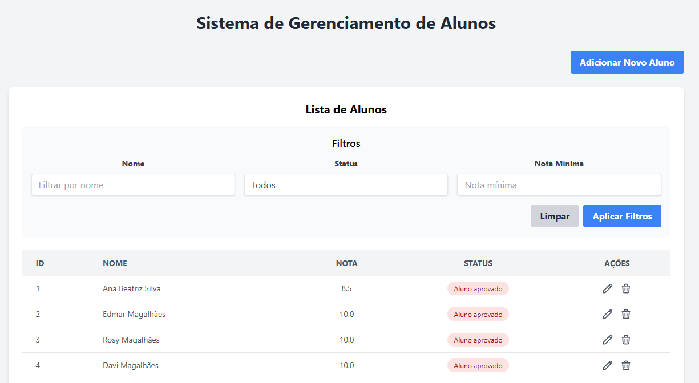
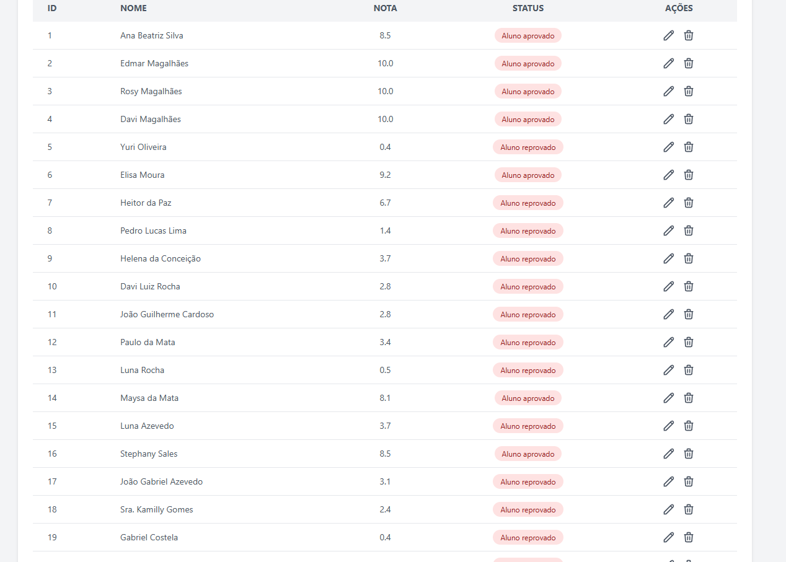
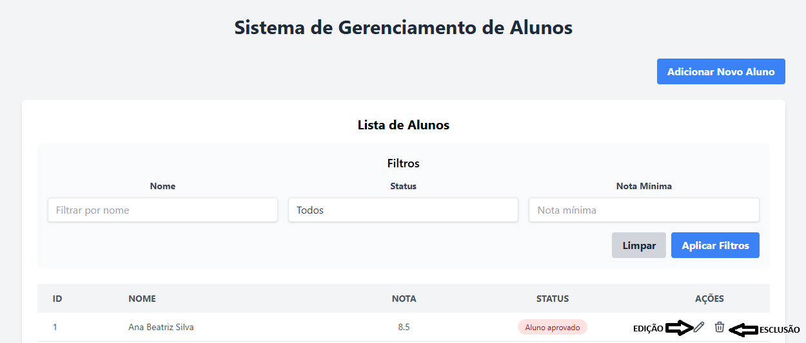

# 🎓 Aluno API + Frontend

Sistema completo para gerenciamento de alunos com cadastro, edição, listagem com filtros e integração com banco de dados PostgreSQL hospedado na nuvem (Neon), backend em Spring Boot e frontend moderno em React + Tailwind.

---

## 🌐 Demonstração

- 🔗 Backend online: [aluno-api.onrender.com](https://aluno-api.onrender.com/alunos)
- 🎯 Frontend online: [aluno-frontend.onrender.com](https://aluno-frontend.onrender.com)

---

## 📸 Imagens

### 🖼️ Banner


### 📋 Lista de Alunos


### 📝 Cadastro / Edição


---

## 🚀 Como rodar o projeto

### 🔁 Clone o repositório
```bash
git clone https://github.com/EdmarMagalhaes/aluno-api.git
cd aluno-api
```

### 🔧 Backend (Spring Boot)
```bash
cd backend
./mvnw spring-boot:run
```

### 💻 Frontend (React + Vite)
```bash
cd frontend
npm install
npm run dev
```

---

## 🔍 Funcionalidades

- ✅ Cadastro de aluno
- ✅ Edição de aluno
- ✅ Exclusão de aluno
- ✅ Filtros por nome, status (Aprovado/Reprovado) e nota mínima
- ✅ API REST documentada
- ✅ Banco de dados PostgreSQL na nuvem (Neon)
- ✅ Deploy completo com Render

---

## 🛠️ Tecnologias

- **Spring Boot 3**
- **Java 17**
- **React + Vite + TypeScript**
- **Tailwind CSS**
- **Neon (PostgreSQL Cloud)**
- **Render (Deploy)**

---

## 👨‍💻 Autor

**Edmar Magalhães**  
[GitHub](https://github.com/EdmarMagalhaes)
